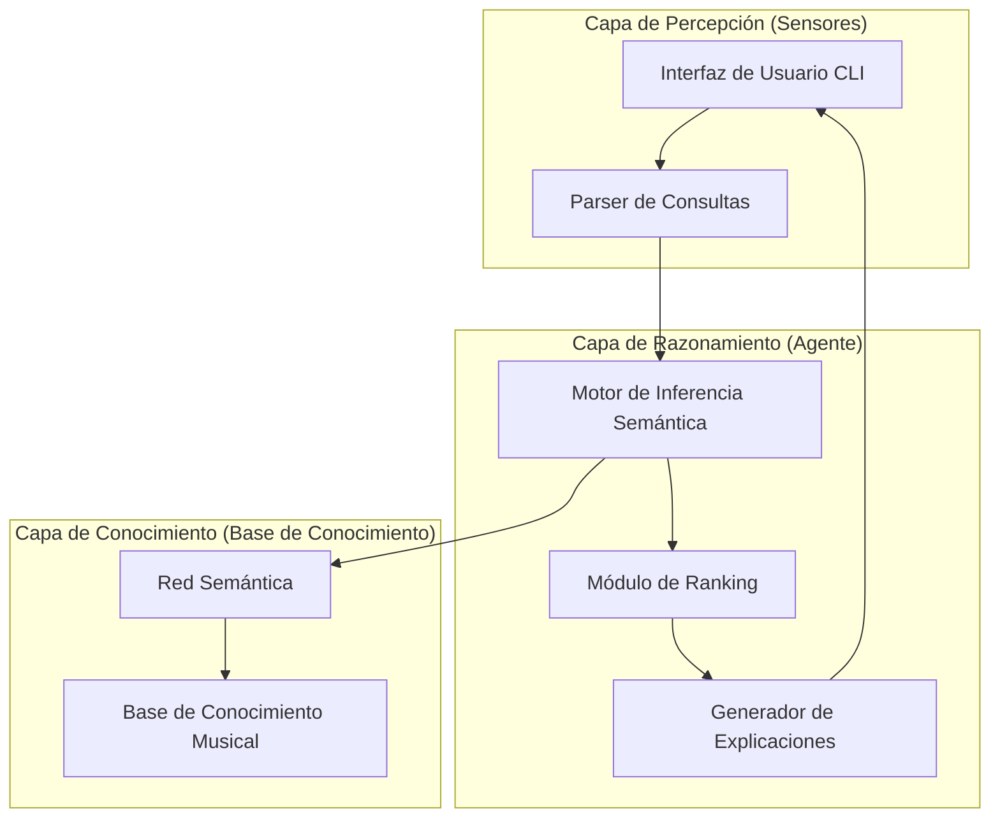
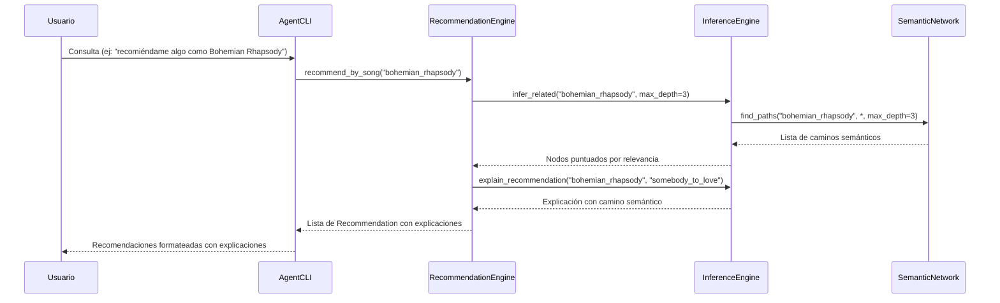
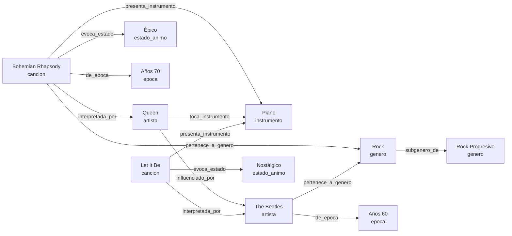

# Documento de Diseño Técnico

## Visión General

Este documento describe el diseño técnico para el proyecto de investigación de Maestría: un **Agente Inteligente basado en Redes Semánticas para la Recomendación de Música**. El proyecto tiene dos entregables principales:

1. **Documento de investigación académico** — siguiendo la estructura requerida por las reglas del proyecto (introducción, planteamiento del problema, justificación, objetivos, marco teórico, estado del arte, propuesta de solución, implementación, evaluación, conclusiones y referencias).
2. **Prototipo funcional** — implementación del agente inteligente con su red semántica y motor de inferencia.

### Enfoque del Diseño

El diseño se fundamenta en:
- **Capítulo 2 del libro de referencia**: Agentes Inteligentes — tipos de agentes, entornos de tarea, descripción PEAS (Performance, Environment, Actuators, Sensors).
- **Capítulo 10 del libro de referencia**: Representación del Conocimiento — redes semánticas como estructura de nodos y arcos tipados para modelar relaciones entre conceptos.
- **Papers de referencia**: H. Li et al. (2016), F. Bani Younes et al. (2018), F. Tang et al. (2017), A. Ba et al. (2015), M. Wang et al. (2019), R. Gupta et al. (2017), J. Zhang et al. (2019), G. Wu et al. (2018).

---

## Planteamiento del Problema

### La Sobrecarga de Información en Plataformas de Streaming Musical

La industria del streaming musical ha experimentado un crecimiento exponencial en la última década, generando un fenómeno de sobrecarga de información sin precedentes. Spotify reporta un catálogo que supera los 100 millones de pistas disponibles, con más de 600 millones de usuarios activos a nivel global ([Spotify](https://newsroom.spotify.com/)). Apple Music ofrece un catálogo de magnitud comparable, superando igualmente los 100 millones de canciones ([Apple Music](https://www.apple.com/apple-music/)). YouTube Music, por su parte, posee el catálogo efectivo más extenso del ecosistema de streaming, al integrar no solo pistas oficiales sino también presentaciones en vivo, remixes, covers y contenido exclusivo que no existe en otras plataformas ([Lissen, 2026](https://www.lissen.com/blog/reviews/youtube-music-review-2026)). En conjunto, estas tres plataformas principales superan los 600 millones de usuarios combinados a nivel mundial.

Esta abundancia masiva de contenido musical genera una paradoja: mientras más opciones tiene el usuario, más difícil se vuelve descubrir música relevante y satisfactoria. El usuario promedio se enfrenta a un catálogo cuya magnitud excede por varios órdenes de magnitud su capacidad de exploración, lo que convierte a los sistemas de recomendación en componentes críticos de la experiencia de usuario en estas plataformas.

### Limitaciones del Filtrado Colaborativo

El filtrado colaborativo (Collaborative Filtering, CF) ha sido históricamente el enfoque dominante en sistemas de recomendación musical. Sin embargo, como identifican H. Li et al. (2016) en su investigación sobre recomendación musical basada en redes semánticas, este enfoque presenta limitaciones fundamentales:

1. **Dependencia de datos históricos de usuarios**: El CF requiere un volumen significativo de interacciones previas (reproducciones, calificaciones, listas de reproducción) para construir perfiles de usuario y calcular similitudes entre ellos. Esto significa que la calidad de las recomendaciones está directamente condicionada por la cantidad y calidad de datos de comportamiento acumulados, lo cual resulta problemático en plataformas con catálogos en constante expansión donde nuevas canciones se agregan diariamente sin historial de interacción.

2. **Problema del arranque en frío (cold start)**: Cuando un nuevo usuario ingresa al sistema o cuando se incorpora un nuevo ítem al catálogo, el CF carece de datos suficientes para generar recomendaciones significativas. Este problema es particularmente agudo en el dominio musical, donde artistas emergentes y lanzamientos recientes — precisamente el contenido que más se beneficiaría de la recomendación — son los más afectados por la ausencia de datos históricos (H. Li et al., 2016).

3. **Falta de explicabilidad**: Las recomendaciones generadas por CF se basan en patrones estadísticos de co-ocurrencia entre usuarios, lo que produce sugerencias del tipo "usuarios similares a ti también escucharon X". Este mecanismo opera como una caja negra que no puede articular *por qué* una canción es relevante en términos musicales — no puede explicar que una recomendación se debe a afinidades de género, similitudes instrumentales, conexiones entre artistas o correspondencias de estado de ánimo (H. Li et al., 2016).

### Limitaciones del Filtrado Basado en Contenido

El filtrado basado en contenido (Content-Based Filtering, CBF) intenta superar algunas limitaciones del CF al analizar las características intrínsecas de los ítems. No obstante, como señalan F. Bani Younes et al. (2018) en su trabajo sobre redes semánticas aplicadas a la recomendación, este enfoque también presenta deficiencias significativas:

1. **Análisis superficial de atributos**: El CBF típicamente opera sobre metadatos explícitos (género, artista, año, tempo, tonalidad) o características acústicas extraídas automáticamente. Este análisis se limita a atributos individuales y no captura las relaciones complejas que existen entre las entidades del dominio musical — por ejemplo, la influencia de un artista sobre otro, la evolución de un género a lo largo de décadas, o la conexión entre un estado de ánimo y una combinación particular de instrumentos (F. Bani Younes et al., 2018).

2. **Incapacidad de capturar relaciones semánticas profundas**: Las representaciones planas basadas en vectores de características no pueden modelar la riqueza relacional del dominio musical. Una canción no es simplemente un conjunto de atributos aislados, sino un nodo en una red compleja de relaciones: pertenece a un género que es subgénero de otro, fue interpretada por un artista que fue influenciado por otros artistas, evoca estados de ánimo que comparte con canciones de épocas distintas, y presenta instrumentos que caracterizan tradiciones musicales específicas. El CBF convencional no tiene mecanismos para representar ni explotar esta estructura relacional (F. Bani Younes et al., 2018).

3. **Tendencia a recomendaciones homogéneas**: Al basarse exclusivamente en la similitud de atributos con ítems previamente consumidos, el CBF tiende a generar un efecto de "burbuja de filtro" (filter bubble), donde las recomendaciones se vuelven progresivamente más homogéneas y predecibles. El usuario queda atrapado en un ciclo de contenido similar que limita el descubrimiento de música nueva y diversa, reduciendo la serendipia que es fundamental para una experiencia musical enriquecedora (F. Bani Younes et al., 2018).

### Formulación del Problema Central

A partir del análisis de las limitaciones de los enfoques tradicionales, se identifica el problema central que motiva esta investigación:

> **No existe un mecanismo de recomendación musical que capture y explote las relaciones semánticas complejas entre las entidades del dominio musical — géneros, artistas, canciones, estados de ánimo, instrumentos y épocas — de manera que permita generar recomendaciones diversas, explicables y fundamentadas en el conocimiento estructurado del dominio.**

Los enfoques de filtrado colaborativo operan sobre patrones de comportamiento de usuarios sin comprender el dominio musical. Los enfoques basados en contenido analizan atributos superficiales sin capturar la estructura relacional profunda. Ninguno de los dos aprovecha el hecho de que el dominio musical posee una estructura semántica inherentemente rica, donde las entidades están interconectadas por relaciones tipadas y significativas que pueden ser representadas, razonadas y explotadas computacionalmente.

Esta brecha motiva el desarrollo de un **agente inteligente basado en redes semánticas** que, al representar el conocimiento musical como un grafo de nodos y arcos tipados (según los principios de representación del conocimiento del Capítulo 10 del libro de referencia), pueda:
- Capturar relaciones semánticas multi-nivel entre entidades musicales
- Realizar inferencia semántica para descubrir conexiones implícitas
- Generar recomendaciones explicables con caminos de razonamiento trazables
- Superar el problema del arranque en frío mediante el conocimiento estructurado del dominio
- Promover la diversidad en las recomendaciones al explorar múltiples dimensiones semánticas

---

### Hallazgos Clave de la Investigación

- Los grafos de conocimiento y redes semánticas proporcionan **explicabilidad inherente** en sistemas de recomendación, ya que cada sugerencia se fundamenta en caminos semánticos trazables entre nodos ([Springer, 2021](https://link.springer.com/article/10.1007/s11280-021-00912-4)).
- La Music Ontology y ontologías musicales existentes demuestran que el dominio musical se presta naturalmente a representación mediante grafos con nodos tipados ([ResearchGate — The Music Ontology](https://www.researchgate.net/publication/200688653_The_Music_Ontology)).
- Los algoritmos de recomendación basados en grafos de conocimiento mejoran la precisión al explotar relaciones multi-hop entre usuarios e ítems ([Nature, 2024](https://www.nature.com/articles/s41598-024-52463-z)).

---

## Arquitectura

### Arquitectura General del Sistema

El sistema se compone de tres capas principales, alineadas con la arquitectura de un agente inteligente basado en conocimiento (Capítulo 2):



### Descripción PEAS del Agente

Siguiendo el marco PEAS del Capítulo 2 del libro de referencia:

| Componente | Descripción |
|---|---|
| **Performance (Rendimiento)** | Precisión de recomendaciones (precision@k, recall@k), relevancia percibida por usuarios, calidad de explicaciones generadas |
| **Environment (Entorno)** | Base de conocimiento musical estática, consultas de usuario en texto, dominio acotado de géneros/artistas/canciones |
| **Actuators (Actuadores)** | Lista ordenada de recomendaciones con explicaciones semánticas, caminos de inferencia visualizables |
| **Sensors (Sensores)** | Entrada de texto del usuario (consultas, preferencias, restricciones), selección de ítems del catálogo |

### Tipo de Agente

El agente se clasifica como un **agente basado en conocimiento** (knowledge-based agent) según la taxonomía del Capítulo 2:
- Mantiene una representación interna del mundo (la red semántica)
- Razona sobre esa representación para tomar decisiones (inferencia semántica)
- No aprende de forma autónoma (limitación declarada en el alcance)

### Propiedades del Entorno de Tarea

| Propiedad | Clasificación | Justificación |
|---|---|---|
| Observable | Totalmente observable | El agente tiene acceso completo a la base de conocimiento |
| Determinista | Determinista | La misma consulta sobre la misma base produce los mismos resultados |
| Episódico | Episódico | Cada consulta es independiente |
| Estático | Estático | La base de conocimiento no cambia durante la ejecución |
| Discreto | Discreto | Conjunto finito de entidades y relaciones |
| Agente único | Agente único | Un solo agente opera sobre la base |

---

## Componentes e Interfaces

### 1. Módulo de Red Semántica (`semantic_network`)

Responsable de la estructura de datos del grafo y operaciones básicas.

**Interfaz:**
```python
class SemanticNetwork:
    def add_node(self, node_id: str, node_type: NodeType, attributes: dict) -> Node
    def add_edge(self, source_id: str, target_id: str, relation: RelationType, weight: float = 1.0) -> Edge
    def get_node(self, node_id: str) -> Optional[Node]
    def get_neighbors(self, node_id: str, relation: Optional[RelationType] = None) -> List[Node]
    def find_paths(self, source_id: str, target_id: str, max_depth: int = 4) -> List[Path]
    def get_nodes_by_type(self, node_type: NodeType) -> List[Node]
    def serialize(self) -> dict
    def deserialize(self, data: dict) -> None
```

### 2. Motor de Inferencia Semántica (`inference_engine`)

Implementa los algoritmos de recorrido y razonamiento sobre la red.

**Interfaz:**
```python
class InferenceEngine:
    def __init__(self, network: SemanticNetwork)
    def infer_related(self, node_id: str, max_depth: int = 3) -> List[ScoredNode]
    def infer_by_similarity(self, node_id: str, target_type: NodeType) -> List[ScoredNode]
    def compute_semantic_distance(self, node_a: str, node_b: str) -> float
    def find_semantic_paths(self, source: str, target: str) -> List[SemanticPath]
    def explain_recommendation(self, source: str, recommended: str) -> Explanation
```

### 3. Motor de Recomendación (`recommendation_engine`)

Orquesta la generación de recomendaciones usando el motor de inferencia.

**Interfaz:**
```python
class RecommendationEngine:
    def __init__(self, inference: InferenceEngine)
    def recommend_by_song(self, song_id: str, top_k: int = 5) -> List[Recommendation]
    def recommend_by_artist(self, artist_id: str, top_k: int = 5) -> List[Recommendation]
    def recommend_by_mood(self, mood: str, top_k: int = 5) -> List[Recommendation]
    def recommend_by_genre(self, genre: str, top_k: int = 5) -> List[Recommendation]
    def recommend_composite(self, preferences: UserPreferences, top_k: int = 5) -> List[Recommendation]
```

### 4. Interfaz de Usuario (`cli_interface`)

Interfaz de línea de comandos para interacción con el agente.

**Interfaz:**
```python
class AgentCLI:
    def __init__(self, engine: RecommendationEngine)
    def run(self) -> None
    def process_query(self, query: str) -> AgentResponse
    def display_recommendations(self, recommendations: List[Recommendation]) -> str
    def display_explanation(self, explanation: Explanation) -> str
```

### 5. Constructor de Base de Conocimiento (`knowledge_builder`)

Carga y construye la red semántica a partir de datos fuente.

**Interfaz:**
```python
class KnowledgeBuilder:
    def __init__(self, network: SemanticNetwork)
    def load_from_json(self, filepath: str) -> None
    def export_to_json(self, filepath: str) -> None
    def add_song(self, song_data: dict) -> str
    def add_artist(self, artist_data: dict) -> str
    def build_relationships(self) -> int
    def validate_network(self) -> ValidationResult
```

### Diagrama de Interacción entre Componentes



---

## Modelos de Datos

### Tipos de Nodos (`NodeType`)

Los nodos representan las entidades del dominio musical:

```python
class NodeType(Enum):
    SONG = "cancion"           # Canción individual
    ARTIST = "artista"         # Artista o banda
    GENRE = "genero"           # Género musical
    MOOD = "estado_animo"      # Estado de ánimo asociado
    INSTRUMENT = "instrumento" # Instrumento predominante
    ERA = "epoca"              # Época o década
    ALBUM = "album"            # Álbum
```

### Tipos de Relaciones (`RelationType`)

Los arcos representan relaciones semánticas tipadas entre nodos:

```python
class RelationType(Enum):
    # Relaciones Artista-Canción
    PERFORMED_BY = "interpretada_por"      # Canción → Artista
    COMPOSED_BY = "compuesta_por"          # Canción → Artista
    
    # Relaciones de Género
    BELONGS_TO_GENRE = "pertenece_a_genero"  # Canción/Artista → Género
    SUBGENRE_OF = "subgenero_de"             # Género → Género
    
    # Relaciones de Estado de Ánimo
    EVOKES_MOOD = "evoca_estado"             # Canción → Estado de ánimo
    
    # Relaciones de Instrumento
    FEATURES_INSTRUMENT = "presenta_instrumento"  # Canción → Instrumento
    PLAYS_INSTRUMENT = "toca_instrumento"          # Artista → Instrumento
    
    # Relaciones Temporales
    FROM_ERA = "de_epoca"                    # Canción/Artista → Época
    
    # Relaciones de Álbum
    IN_ALBUM = "en_album"                    # Canción → Álbum
    ALBUM_BY = "album_de"                    # Álbum → Artista
    
    # Relaciones de Similitud
    SIMILAR_TO = "similar_a"                 # Artista ↔ Artista, Canción ↔ Canción
    INFLUENCED_BY = "influenciado_por"       # Artista → Artista
```

### Estructura de Nodo

```python
@dataclass
class Node:
    id: str                    # Identificador único (slug)
    node_type: NodeType        # Tipo de nodo
    name: str                  # Nombre legible
    attributes: dict           # Atributos adicionales específicos del tipo
```

### Estructura de Arco

```python
@dataclass
class Edge:
    source_id: str             # Nodo origen
    target_id: str             # Nodo destino
    relation: RelationType     # Tipo de relación
    weight: float = 1.0        # Peso de la relación (0.0 - 1.0)
```

### Estructura de Recomendación

```python
@dataclass
class Recommendation:
    item: Node                          # Nodo recomendado
    score: float                        # Puntuación de relevancia
    explanation: Explanation             # Explicación del por qué
    semantic_paths: List[SemanticPath]   # Caminos semánticos que justifican la recomendación

@dataclass
class Explanation:
    summary: str                        # Resumen en lenguaje natural
    paths: List[SemanticPath]           # Caminos en la red
    reasoning_steps: List[str]          # Pasos de razonamiento

@dataclass
class SemanticPath:
    nodes: List[str]                    # IDs de nodos en el camino
    relations: List[RelationType]       # Relaciones entre nodos consecutivos
    total_weight: float                 # Peso acumulado del camino
```

### Ejemplo de Red Semántica del Dominio Musical



### Formato de la Base de Conocimiento (JSON)

```json
{
  "nodes": [
    {
      "id": "bohemian_rhapsody",
      "type": "cancion",
      "name": "Bohemian Rhapsody",
      "attributes": {
        "year": 1975,
        "duration_seconds": 355
      }
    },
    {
      "id": "queen",
      "type": "artista",
      "name": "Queen",
      "attributes": {
        "country": "Reino Unido",
        "active_years": "1970-1995"
      }
    }
  ],
  "edges": [
    {
      "source": "bohemian_rhapsody",
      "target": "queen",
      "relation": "interpretada_por",
      "weight": 1.0
    }
  ]
}
```

### Algoritmo de Inferencia Semántica

El motor de inferencia utiliza un recorrido BFS ponderado sobre la red semántica:

1. **Expansión**: Desde el nodo de consulta, se expanden vecinos hasta `max_depth`
2. **Puntuación**: Cada nodo alcanzado recibe una puntuación basada en:
   - Distancia semántica (inversa de la longitud del camino)
   - Peso acumulado de las relaciones en el camino
   - Diversidad de tipos de relación en el camino
3. **Filtrado**: Se filtran nodos del tipo objetivo (ej: canciones)
4. **Ranking**: Se ordenan por puntuación descendente
5. **Explicación**: Para cada recomendación, se genera una explicación basada en el camino semántico más relevante

**Fórmula de puntuación:**

```
score(target) = Σ (path_weight(p) / path_length(p)) * diversity_bonus(p)
```

Donde:
- `path_weight(p)` = producto de los pesos de las aristas en el camino `p`
- `path_length(p)` = número de aristas en el camino
- `diversity_bonus(p)` = factor que premia caminos con variedad de tipos de relación


---

## Propiedades de Correctitud

*Una propiedad es una característica o comportamiento que debe mantenerse verdadero en todas las ejecuciones válidas de un sistema — esencialmente, una declaración formal sobre lo que el sistema debe hacer. Las propiedades sirven como puente entre especificaciones legibles por humanos y garantías de correctitud verificables por máquina.*

> **Nota:** La mayoría de los requisitos de este proyecto (Requisitos 1-7) son requisitos de contenido del documento de investigación académico, no requisitos funcionales de software. Estos se verifican mediante revisión manual y listas de verificación. Las propiedades a continuación aplican exclusivamente al **prototipo funcional** del agente inteligente.

### Propiedad 1: Viaje de ida y vuelta de serialización de la red semántica

*Para cualquier* red semántica válida con nodos y arcos arbitrarios, serializar la red a formato JSON y luego deserializarla debe producir una red equivalente — con los mismos nodos, arcos, tipos, atributos y pesos.

**Valida: Diseño del módulo `semantic_network` (serialize/deserialize), Requisito 6.1 (persistencia de la base de conocimiento)**

### Propiedad 2: El motor de inferencia descubre conexiones indirectas

*Para cualquier* red semántica y cualquier par de nodos conectados por un camino de longitud ≤ `max_depth`, el motor de inferencia debe encontrar al menos un camino entre ellos. Esto valida que la inferencia semántica descubre relaciones implícitas no representadas como arcos directos.

**Valida: Requisito 2.2 (la inferencia semántica descubre relaciones implícitas)**

### Propiedad 3: Consistencia de puntuación con distancia semántica

*Para cualquier* red semántica y nodo de consulta, si el nodo A tiene un camino semántico más corto y/o de mayor peso que el nodo B hacia el nodo de consulta, entonces la puntuación de recomendación de A debe ser mayor o igual que la de B.

**Valida: Diseño del módulo `inference_engine` (algoritmo de ranking)**

### Propiedad 4: Toda recomendación tiene un camino de explicación válido

*Para cualquier* consulta de recomendación que produzca resultados, cada recomendación devuelta debe incluir al menos un camino semántico donde cada arista del camino existe en la red semántica y conecta nodos válidos.

**Valida: Requisito 2.4 (explicabilidad inherente de las recomendaciones)**

### Propiedad 5: Simetría de distancia semántica para relaciones simétricas

*Para cualquier* par de nodos conectados exclusivamente por relaciones simétricas (como `SIMILAR_TO`), la distancia semántica calculada de A a B debe ser igual a la distancia de B a A.

**Valida: Diseño del módulo `inference_engine` (compute_semantic_distance)**

### Propiedad 6: La validación de red detecta referencias inválidas

*Para cualquier* red semántica que contenga arcos con referencias a nodos inexistentes, la función de validación debe reportar al menos un error identificando las referencias rotas.

**Valida: Diseño del módulo `knowledge_builder` (validate_network), Requisito 6.1 (integridad de la base de conocimiento)**

---

## Manejo de Errores

### Errores de Carga de Base de Conocimiento

| Error | Causa | Manejo |
|---|---|---|
| `FileNotFoundError` | Archivo JSON de base de conocimiento no encontrado | Mensaje descriptivo, solicitar ruta correcta |
| `JSONDecodeError` | Formato JSON inválido | Mensaje con línea/posición del error |
| `ValidationError` | Nodos o arcos con datos incompletos/inválidos | Reporte detallado de entidades inválidas, carga parcial de datos válidos |
| `BrokenReferenceError` | Arco referencia nodo inexistente | Advertencia, omisión del arco inválido |

### Errores de Consulta

| Error | Causa | Manejo |
|---|---|---|
| `NodeNotFoundError` | Consulta referencia entidad no existente en la red | Sugerir entidades similares por nombre |
| `EmptyResultError` | No se encontraron recomendaciones | Informar al usuario, sugerir consultas alternativas |
| `MaxDepthExceededError` | Profundidad de búsqueda excede límite | Retornar resultados parciales con advertencia |

### Errores de Inferencia

| Error | Causa | Manejo |
|---|---|---|
| `CyclicPathError` | Detección de ciclo durante recorrido | Marcar nodos visitados, evitar revisita |
| `DisconnectedGraphError` | Nodo de consulta no conectado a nodos objetivo | Informar que no hay camino semántico disponible |

### Estrategia General

- Todos los errores se registran con nivel de severidad (INFO, WARNING, ERROR)
- Los errores no fatales permiten operación degradada (resultados parciales)
- Los errores fatales (base de conocimiento corrupta) detienen la ejecución con mensaje claro
- No se utilizan excepciones silenciosas — todo error se comunica al usuario

---

## Estrategia de Testing

### Enfoque Dual de Testing

El prototipo utiliza un enfoque dual complementario:

1. **Tests unitarios (example-based)**: Verifican comportamientos específicos con ejemplos concretos
2. **Tests de propiedades (property-based)**: Verifican propiedades universales con entradas generadas aleatoriamente

### Tests de Propiedades (Property-Based Testing)

**Biblioteca**: `hypothesis` (Python)

**Configuración**: Mínimo 100 iteraciones por propiedad.

Cada propiedad del diseño se implementa como un test de propiedad individual:

| Propiedad | Tag del Test |
|---|---|
| Propiedad 1 | `Feature: semantic-network-agent, Property 1: Serialization round-trip preserves network` |
| Propiedad 2 | `Feature: semantic-network-agent, Property 2: Inference discovers indirect connections` |
| Propiedad 3 | `Feature: semantic-network-agent, Property 3: Score consistency with semantic distance` |
| Propiedad 4 | `Feature: semantic-network-agent, Property 4: Every recommendation has valid explanation path` |
| Propiedad 5 | `Feature: semantic-network-agent, Property 5: Symmetric distance for symmetric relations` |
| Propiedad 6 | `Feature: semantic-network-agent, Property 6: Validation detects broken references` |

**Generadores necesarios**:
- Generador de redes semánticas aleatorias (nodos con tipos válidos, arcos con relaciones válidas)
- Generador de consultas válidas (nodo existente en la red)
- Generador de redes con referencias rotas (para Propiedad 6)

### Tests Unitarios

Los tests unitarios cubren:

- **Operaciones básicas de la red**: agregar/eliminar nodos y arcos, consultar vecinos
- **Casos borde**: red vacía, nodo aislado, consulta a nodo inexistente
- **Carga de datos**: JSON válido, JSON malformado, datos incompletos
- **Formato de explicaciones**: verificar que las explicaciones generadas son legibles
- **Integración CLI**: verificar que las consultas de texto se parsean correctamente

### Tests de Integración

- Carga completa de la base de conocimiento de ejemplo
- Flujo completo: consulta → inferencia → recomendación → explicación
- Verificación de que el prototipo cumple con el tamaño mínimo de base de conocimiento declarado en el alcance

### Verificación del Documento de Investigación

Los requisitos 1-7 son requisitos de contenido del documento académico. Se verifican mediante:

- **Lista de verificación (checklist)** por cada criterio de aceptación
- **Revisión por pares** del contenido académico
- **Verificación de referencias** — todas las citas existen y son accesibles
- **Verificación de estructura** — el documento sigue el formato requerido por las reglas del proyecto

### Evaluación del Agente (Requisito 4.2d, Requisito 6.2c)

La evaluación del prototipo incluye:

1. **Métricas cuantitativas**: Precision@k, Recall@k sobre un conjunto de prueba con recomendaciones esperadas
2. **Evaluación cualitativa**: Encuesta a grupo reducido de usuarios sobre relevancia y calidad de explicaciones
3. **Cobertura de la red**: Porcentaje de nodos alcanzables desde cualquier nodo de consulta
4. **Calidad de explicaciones**: Verificar que cada explicación contiene un camino semántico válido y comprensible
